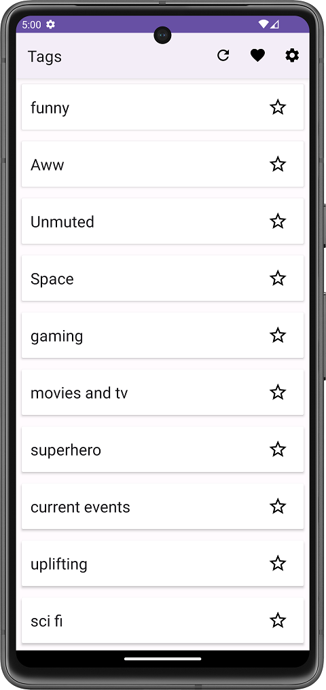
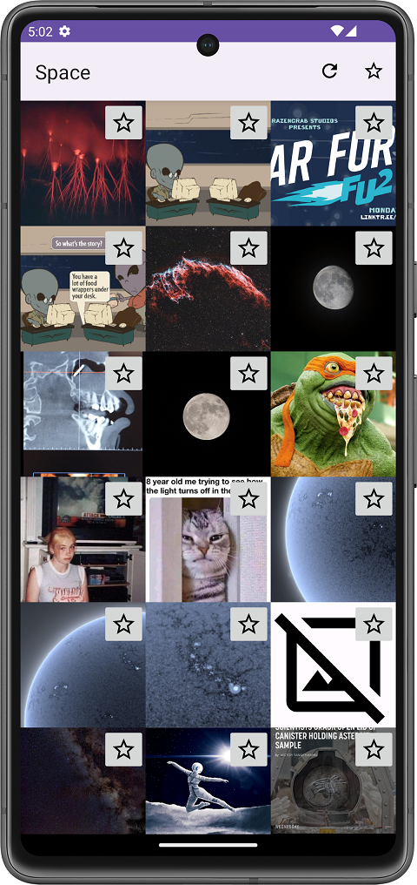
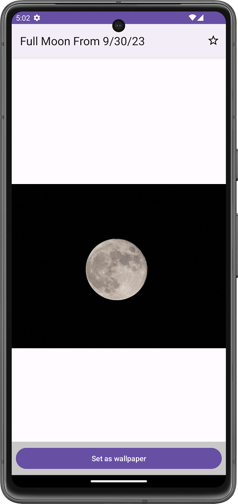
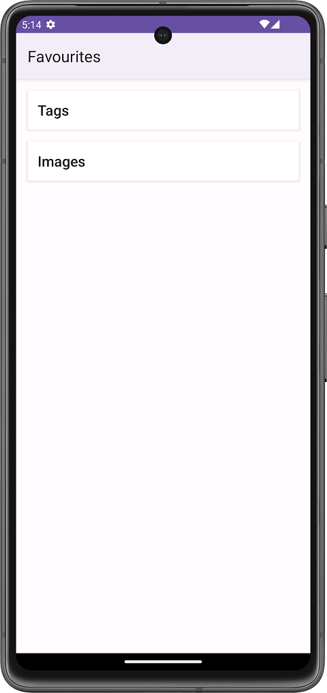

# Wallpaper App

## 1. Используемые технологии

* Hilt / Dagger
* Coroutines
* Retrofit
* RecyclerView
* MVVM
* Preference API
* Coil
* Room

## 2. Технические особенности

- Показ списка изображений через RecyclerView
- Кэширование изображений (в оперативной и постоянной памяти)
- Сохранение данных об избранных тегах и изображениях локально

## 3. Фичи приложения

- Получение списка тегов (категорий) и списка изображений по тегу с Imgur
- Смена темы приложения (Светлая, тёмная, как в системе)
- Установка обоев (Экран блокировки, главный экран, оба экрана)
- Добавление тегов и изображений в избранное

## 4. Скриншоты приложения

### 4.1 Главный экран

На главном экране расположен список тегов. С главного экрана можно перейти на экран списка изображений по тегу, настройки и избранные теги и изображения. Экран можно обновить для получение актуально информации.

### 4.2 Экран списка изображений по теги

Содержит в себе изображения. Можно перейти на экран конкретного изображения. Каждое изображение можно пометить как избранное. Экран можно обновить для получение актуальной информации.

### 4.3 Экран конкретного изображения

Содержит изображение, кнопку установки как обоев и кнопку добавление в изранное.

### 4.4 Экран избранных

Экран избранных содержит две кнопки для переходна на экран с избранными тегами или избранными изображениями.

